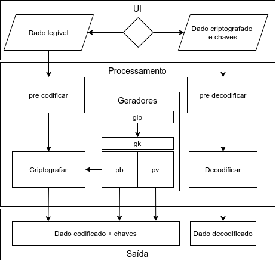

<div align="center">
 
</div>

# cryptinpyc
[](https://github.com/ellerbrock/open-source-badges/)

Este repositório inclui algoritimo de criptografia, cujo objetivo é tornar dados ilegíveis para pessoas não autorizadas a vê-los. Uma pessoa é autorizada a ver o conteúdo criptografado se tem a chave de descriptografia em mãos.
 
 <div align="center"></div>
 
 #### Funções por arquivos:
|Arquivo|Função|
|---|---|
| [`./app/calc.py`](./app/calc.py) | Fornece funções matemáticas para geração das chaves de criptografia e para codificação |
|[`./app/console.py`](./app/console.py)|Permitir que usuário gerencie o programa|
|[`./app/gfile.py`](./app/gfile.py)|Cria e salva resultados gerados|
|[`./app/read.py`](./app/read.py)|Lê e converte dados codificados|
|[`./app/RSA/conversion.py`](./app/RSA/conversion.py)|Codifica e decodifica os dados|
|[`./app/RSA/gk.py`](./app/RSA/gk.py)|Gera chaves (pública e privada)|
|[`./app/RSA/main.py`](./app/RSA/main.py)|Faz codificação inicial e codificação final com base nas chaves geradas.|
|[`./app/RSA/preCoding.py`](./app/RSA/preCoding.py)|Define funções de tradução unicode|
|[`./app/.glp/glp.c`](./app/.glp/glp.c) e [`./app/.glp/glp.py`](./app/.glp/glp.py)|Faz calculos para criação da lista [lp.txt](./app/.glp/lp.txt)|
|[`./app/.glp/glp.sh`](./app/.glp/glp.sh)|É um aparato para escrever números primos encontrados por [`./app/.glp/glp.c`](./app/.glp/glp.c) e [`./app/.glp/glp.py`](./app/.glp/glp.py) em [`lp.txt`](./app/.glp/lp.txt)|

 

## Como usar:
 
Para que você possa interagir com a funcionalidade do programa, há o arquivo [console.py](./app/console.py), que pode ser executado pelo console e possui um guia de ajuda embutido. É importante que você esteja no diretório `app` para que nada inesperado ocorra.
 ```
$ python3 console.py
 ```
 Você pode criptografar dados e estes serão salvos em uma pasta nomeada aleatoriamente, contendo os arquivos: 
 * `ief` (dados criptografados); 
 * `pb` (chave pública);
 * `pv` (chave privada).
 
 **:warning: O arquivo `pv` deve ser retirado do diretório caso queira enviar a pasta confidencialmente para alguém, pois com a chave privada, qualquer entidade se torna capaz de quebrar o sigilo dos dados. Igualmente, deverá ser guardado com segurança, pois sem o mesmo, ninguém será capaz de decifrar os dados.**
 
:warning: Este programa ainda não é apto para proteger dados contra decodificação por probabilidade, não o use para coisas importantes.


## Para contribuir:

1. Faça um fork do projeto;
2. Clone o projeto do seu fork (`git clone https://github.com/SEU_USUARIO/cryptinpyc.git`) **(não se esqueça de mudar SEU_USUÁRIO no link)**;
3. Crie sua branch para realizar sua modificação (`git checkout -b feature/NOME_DA_MODIFICAÇÃO`);
4. Após ter realizado suas modificações, faça um commit (`git commit -m "DESCRIÇÃO_DA_MODIFICAÇÃO"`);
5. Faça o Push para seu repositório (`git push origin feature/NOME_DA_MODIFICAÇÃO`);
6. No seu repositório no Github crie uma Pull Request para que seja avaliada a suas modificações para ser feito o merge no projeto principal.
